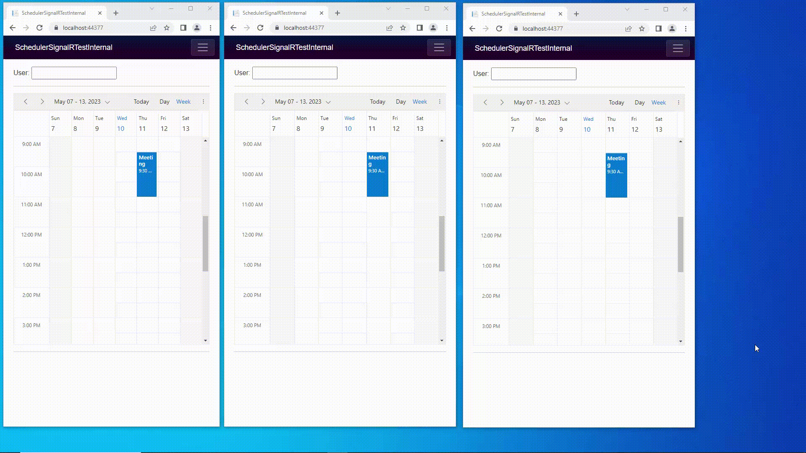

# Make Real-time Updates in a Blazor WebAssembly Application using SignalR
A quick-start Blazor WebAssembly application that is pre-configured with SignalR connection to perform real-time appointment updates on a Blazor Scheduler of Syncfusion.

## Prerequisites
* Visual Studio 2022
* .NET latest version installed in your system

## How to run the project

* Checkout this project to a location in your disk.
* Open the solution file using the Visual Studio 2022.
* Restore the NuGet packages by rebuilding the solution.
* Run the project.
